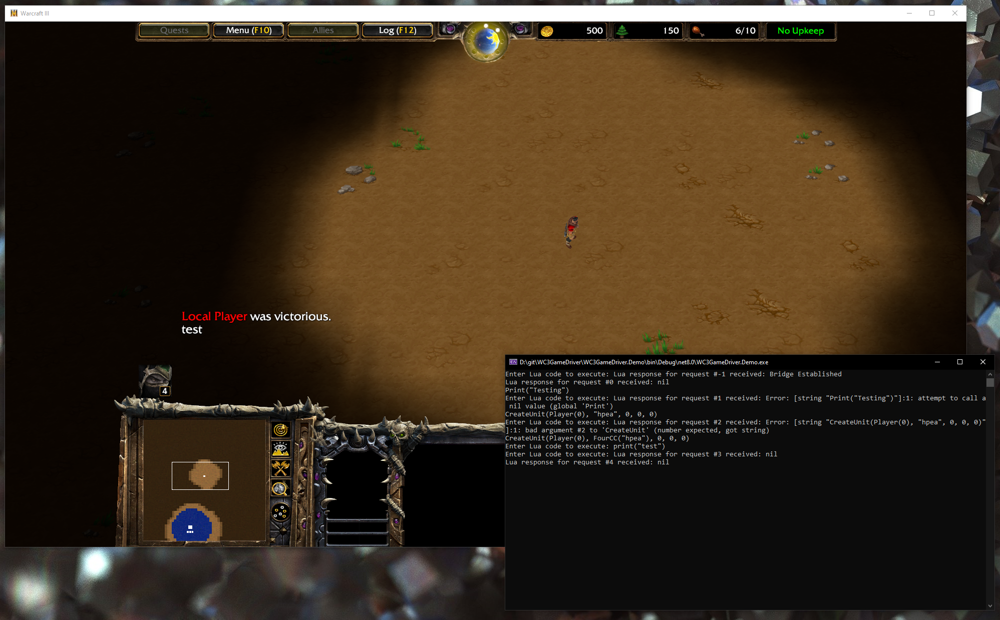

# WC3GameDriver
## WC3GameDriver is a framework for automating and controlling Warcraft III during runtime. It is a development tool designed for modders to interact with the game in real-time, enabling scripting and gameplay modifications.

